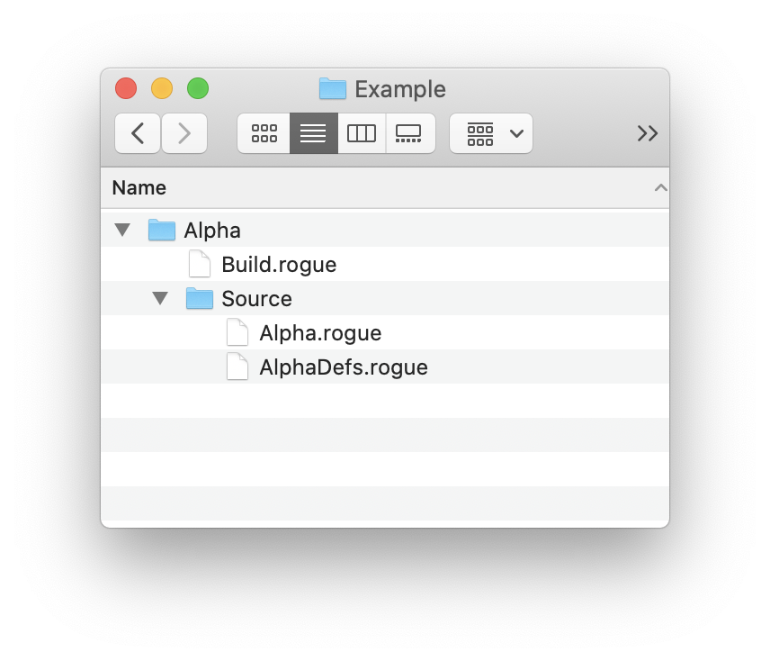
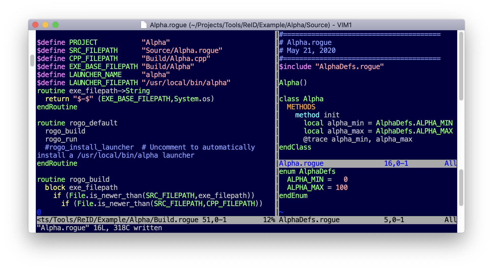
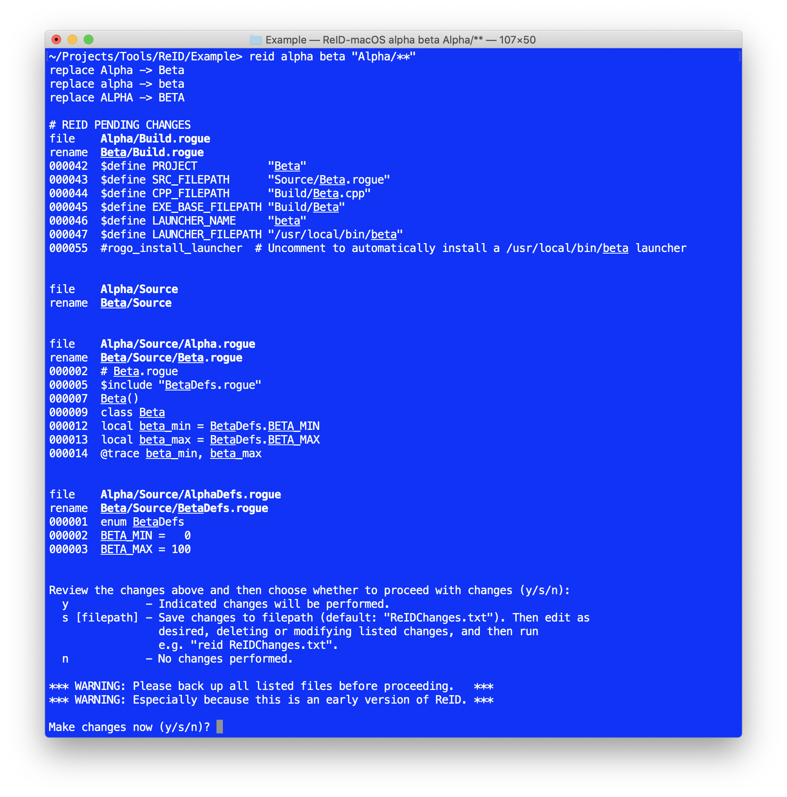
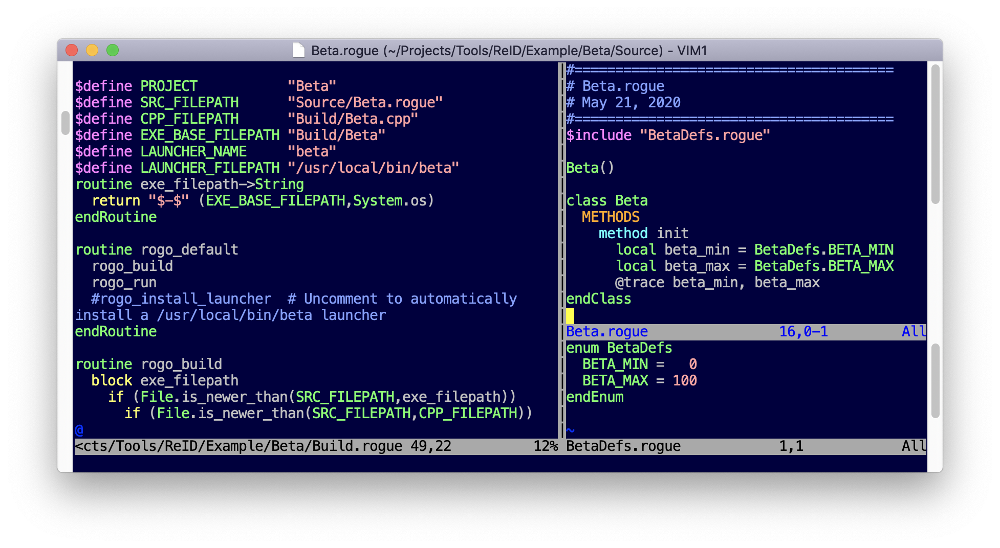

# ReID
Command line tool for replacing identifiers within source code and adjusting folder hierarchies.

## Version
- v1.3 - June 6, 2020
- macOS, Linux, Windows
- [MIT License](LICENSE)
- By Abe Pralle

## Installation
1. Install the [Rogue](https://github.com/AbePralle/Rogue) language.
2. Run `rogo` in this folder to compile **ReID**.
    - On macOS and Linux a launcher will be created here: `/usr/local/bin/reid`.
    - On Windows the build process will print the necessary folder to add to the system PATH environment variable.

## Example
Here is a sample project `Alpha` with its file structure:

And its content:

From outside the `Alpha` folder we run `reid alpha beta "Alpha/**"` (the quotes are necessary for ReID's special wildcards `**` and `***/`):

After we confirm the preview of changes, there is the new `Beta` project file structure:

and the `Beta` file content:

## Usage

    reid [options] OldID NewID           [wildcard_filepaths] [--exclude] [...]
    reid old.package.id  new.package.id  [wildcard_filepaths] [--exclude] [...]
    reid old/folder/path new/folder/path [wildcard_filepaths] [--exclude] [...]
    reid old$pattern new$pattern         [wildcard_filepaths] [--exclude] [...]
    reid ReIDChanges.txt

## Options

- `reid OldID NewID [wildcard_filepaths]` 
  Accepts IDs in any of the following capitalization styles and automatically
  generates the other style variations for ID replacement:

        OldID  -> NewID
        oldID  -> newID
        Old_ID -> New_ID
        old_id -> new_id
        OLD_ID -> NEW_ID
        oldid  -> newid

  Using the given input filepath(s) (or `**` - all files and subfolders in
  the current folder), ReID then generates and displays a list of changes it
  will make to the content of the files and the filepath names. The user can
  then proceed with the changes immediately or save them to an intermediate
  file for editing (e.g. `ReIDChanges.txt`), then running
  `reid ReIDChanges.txt`.

- `reid old.package.id new.package.id [wildcard_filepaths]` 
  Only two id variations are replaced when dots (`.`) are present in the ID:

        old.package.id -> new.package.id
        old/package/id -> new/package/id

  Passing `--exact` limits the search to the dot-separated variation.

- `reid old/folder/path new/folder/path [wildcard_filepaths]` 
  When slashes are present in the search term, ReID replaces only exact
  matches, which are most often folder paths.

- `reid old$pattern new$pattern [wildcard_filepaths]` 
    Uses Rogue's String.replacing_pattern() syntax. Examples:

        reid "$ and $" "$ & $"        # Alice and Bob -> Alice & Bob
        reid "$ and $" "$(1) & $(0)"  # Alice and Bob -> Bob & Alice

- `reid ReIDChanges.txt` 
  When ReID is run, the previewed changes are saved to a file, and the file
  is edited to further adjust the changes, then run `reid <filename>` to
  read and then apply those edited changes.

- `--content` 
    Applies replacements to file content only, not to filenames or folder paths.
    If neither `--content` nor `--files` are specified then both are implied.

- `--exact` 
    The search term is used exactly without added automatic variations.

- `--exclude=<filepattern>` 
    Any files matching the given pattern are skipped.

- `--exclude [...]` 
    Files matching any wildcard patterns coming after `--exclude` are skipped.
    For example:

        --exclude "***/*.backup" "Build/**"

    Note: binary files as well as the default change description output file,
    `ReIDChanges.txt` are excluded by default.

- `--files` 
    Applies replacements to filenames and folder paths only, not to file content.
    If neither `--content` nor `--files` are specified then both are implied.

- `--help` 
    Display this help text.

- `--partial` 
    Allows partial matches within standard identifiers that start with a letter
    or underscore and end with an alpha-numeric character or underscore. For
    example, `reid --partial time date` would replace `timer` with `dater`.
    Note: pattern-based replacements always allow partial matches.

- `--plain` 
    Disables styled text such as bold and underline in the preview of changes.

- `--save`, `-s` 
    Always answers 's' (save) to the "Make changes now?" prompt.

- `--yes`, `-y` 
    Always answers 'y' (yes) to the "Make changes now?" prompt.

- [*wildcard_filepath*] 
    Use "quoted/wildcard/filepaths" to ensure that nonstandard wildcards `**`
    and `**/` are recognized. Note: `?` can be used to match a single character.

        *.rogue      # matches files in the current folder ending with ".rogue"
        **/*.rogue   # matches files in subfolders or in the current folder.
        */**/*.rogue # matches files in subfolders but not in the current folder

